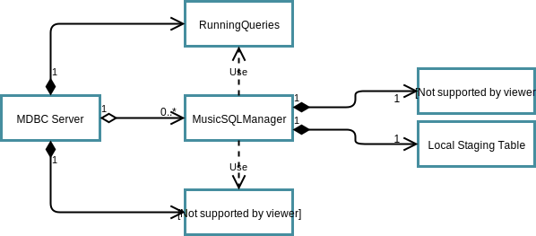
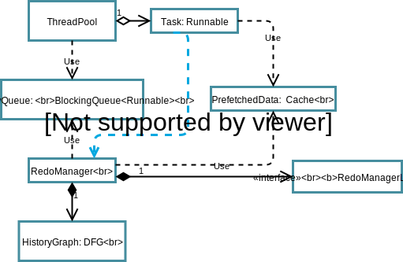
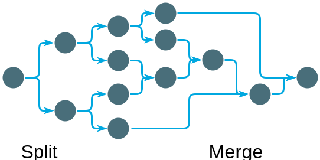

# Architecture

## Music/Cassandra Tables

### Transaction Information Table (TIT)

This table contains the entities that are locked to perform a transaction on a partition, it contains an ordered array that contains information of the transactions.

A row is associated with a specific partition.

There can be more than one row associated with a partition. But only one is active at any given time. There are two main reasons associated with creating a new TIT row:
* Partition merge/split
* The REDO array is too big, and it's better to start a new row

This is a type of table, and there can be many instances of this table in Music. Reasons to have more than one table:
* One table per replication policy, for example, there could be one TIT table with a replication factor of 3 and one TIT table with a replication factor of 5. 
* Other policy requirements

#### Columns

* **id**: UUID 
    - The id of this row 
    - **Note**: Later we could force the index to follow a certain pattern, such that the rows of a given MDBC Server are located as close as possible to that server, without violating any other policy associated with the data.
* **redo**: Array&lt;Tuple&lt;Text,Tuple&lt;Text,varint>>
    - Array (order-matters) of &lt;TableName,Index> associated with the Redo Records that were applied to this partition
* **partition**: UUID 
    - The id of the partition associated with this transaction 
* **latestapplied**: Int 
    - Integer associated with the latest RedoRecord applied from the Redo column into the data tables in Music. 
* **applied**: boolean 
    - Flag that indicates that this row Tx's were already committed to the data tables 

#### Primary

(Partition)

#### Clustering

(Index)

### Redo Records Table (RRT)

This table is the one that contains the TransactionsDigests.

There is one row per transaction.

There is no need to lock on this table.

This is an append/remove only table, no updates are going to be performed.
* Removes are an optimization, not a correctness requirement
* Removes are only executed when the transaction was completely applied to the data tables and all tables that are pointing to this row are already removed.

#### Columns

* **leaseid**: text
	* Id of the lease that was used to process the transaction associated with the row in TIT
* **leasecounter**: varint
	* Transaction number (counter of the transactions performed so far using the lock in leaseid) 
* **transactiondigest**: text
	* Serialized transaction digest, can be considered a blob

#### Primary

(leaseid,leasecounter)

#### Clustering

None 

### TableToPartition Table (TTP)

This table maps each table to the current (and previous) partitions.

#### Columns

* **TableName**: Text 
	- Name of the table to which partitions are being associated 
* **Partition**: UUID 
	- Current partition that holds this table
* **PreviousPartitions**: Set&lt;UUID> 
	- Name of all the previous partitions (inclusive of the current partition)

#### Primary

(Table)

#### Clustering

None

### PartitionInfo Table (PI)

This table contains information about a partition. Contains information about the latest Tit row to be locked if this partition wants to be held. The tables associated with this partition and other information of the partition. 

#### Columns

* **Partition**: UUID 
    - Name of the partition that this row describe
* **LatestTitTable**: Text 
    - Name of the table that contains the latest TransactionInformation row associated with this partition 
* **LatestTitIndex**: UUID 
    - Latest index (row) in the previous table, that is currently is being updated with transactions in this partition
* **Tables**: Set&lt;Text> 
    - All tables that are contained within this partition
* **ReplicationFactor**: Int
* **CurrentOwner**: Text 
    - URL address associated with the current owner

#### Primary

(Partition)

#### Clustering

None

### RedoHistory Table (RH)

This table represents the Directed Graph that forms the history of REDO logs. Given that we create new REDO logs on each new repartition (or due to other reasons), we need to keep track of the changes and the order of the REDO logs. An example of the repartitions can be seen in [figure 3](#figure-3).

#### Columns
* **Partition**: uuid 
	- Partition 
* **RedoTable**:Text
	- TIT table at this point in time for the Partition
* **RedoIndex**:UUID
	- TIT Index for the previous Table 
* **PreviousRedo**: Set&lt;Tuple&lt;Text,UUID>>
	- Contain 

#### Primary
(Partition)

#### Clustering
(RedoTable,RedoIndex)

## Server Architecture

As shown in [figure 1](#figure-1). The MDBC server is composed of the following components:

* **RunningQueries**
* **LocalStagingTable**
* **MusicInterface**
* **MusicSQLManager**
* **SQL**

### Figure 1


**Server Architecture**

### RunningQueries
This is an in-memory data structure that contains the progress of each transaction being executed. Each transaction holds information about:

* **LTxId:** local transaction id, unsigned integer   
* **CommitRequested** bool indicating if the user tries to commit the request already.
* **SQLDone:** bool indicating if SQL was already committed, atomic bool
* **MusicDone:** bool indicating if music commit was already performed, atomic bool
* **Connection:** reference to a connection object. This is used to complete a commit if it failed in the original thread.
* **Timestamp:** last time this data structure was updated
* **RedoRecordId:** id of the redo record when it was already added to the RRT (it contains the info to the table and index)

### LocalStagingTable

This is a serializable in-memory data-structure that contains the information about the changes that were updated by the SQL database for a given transaction. When the transaction is committed, this staging table is freeze and serialized to a string, and committed to Music. See the [algorithms section](#transaction-commit).

There is one table per client connection.

It has one main operation:

```Java
void addOperation(String key, OperationType op, JSONObject oldValue, JSONObject newValue);
```

### MusicInterface

This is the layer that interacts with Music. There is only one instance per MDBC server. It is in charge of holding locks and executing get/puts to Music, following the corresponding locking mechanisms. This object is also used in the MusicSQLManager, so a reference to it is passed when a MusicSQLManager is created.

### MusicSQLManager

When a connection is created from a new MDBC client, a Connection object is created. MusicSQLManager is the object that handles the main operations of a connection that translates operation between SQL and Music.

There is one object of this type for each client connection.

### SQL or DBInterface

This interface the main operations that the MusicSQLMAnager performs with the SQL layer.

## REDO Recovery Architecture

[Figure 2](#figure-2) shows the main components used to recover using the REDO log. First, we are going to analyze what is the REDO history associated with a given node, and then describe each of the components in figure 2 

### Figure 2


**Redo Spec Architecture**

### REDO History

Given that new Redo log rows are created in TIT each time, the system is repartitioned, then a history is created as shown in [figure 3](#figure-3). Each node represents a give TIT row, and the graph is a directed acyclic graph. 

#### Figure 3 


**Redo History Directed Graph**

#### Properties

* The are only two types of repartition: split in two or merge two.
* Each partition can only be split into two partitions
* Only two partitions can be merged into a new partition
* Sometimes one node is transformed into a new node, without split or merge. This can happen due to the reasons explained in previous sections, such as a TIT row being too big. 
* Each partition is going to have a new different name (e.g. use UUID to name them)
* On partition, a new TIT row is created
* The replication policy used is the max of all the tables that are contained within the partition.

#### Node 

Each node in the graph contains the following information

* **RedoTable**: info from RH table
* **RedoIndex**: info from RH table 
* **Tables**: tables that are going to be recovered in that node, obtained from the partition in RH table.
* **TIT Metadata Read**: it is a boolean flag that indicates that the associated metadata was already downloaded.
* **ParentsDoneCounter**: it is a counter that is increased each time one of the parents of the node was successfully applied.
* **LastAppliedChange**: last change applied from this Redo Index to this local MDBC server.
* **TxDigestDownloaded**: a boolean flag that indicates that the TxDigest download task was already downloaded 

All this information is used to implement the algorithms to parallelize the REDO operations.

### Redo Recovery Execution

We decomposed the recovery algorithm into multiple independent tasks that are going to be executed by a pool of threads. There are three main types of tasks:

1. Download Metadata (embarrassingly parallel)
2. Download Transaction Digests (embarrassingly parallel)
3. Apply Digests (Sequential with concurrency)

To save memory usage, and avoid pulling too much data before it is actually consumed, we cannot perform this tasks in this same order. Additionally, prefetched data can be erased, if there is too much data downloaded that was not committed in time. 

### RedoManager 

This is the entity in charge of defining the next tasks to execute and to initialize the REDO recovery and all the required data structures, including the thread pool.

### RedoManagerLogic

This is the logic within the redo manager. It is created to allow extension of the algorithms for selecting the tasks.

#### Interface
```java
void init(HistoryGraph history);
List<Task> getInitialTasks();
List<Task> setCompleted(Task completedTask);
boolean isDone();
```

### PrefetchedData

This is going to contain the results of tasks of type 1. and 2. If the recovery algorithm overprovisioned memory, the RedoManager can request to delete the least important data (further to the right in [figure 3](#figure-3)), and it would return the task that was used to generate it. Such that it can be read to the TaskPriorityQueue


#### Interface
```java
Metadata getMetadata(int NoodeIdx);
Digest getTransaction(int NodeIdx, String table, UUID row);
Task deleteLessImportant();
void addMetadata(int NodeIdx, Metadata meta, Task task);
void addDigest(int NodeIdx, String table, UUID row, TxDigest tx, Task task);
long getSize();
```

### HistoryGraph

This is the object that is going to model the REDO history and will be used to create the plan for recovery. Additionally, it would hold the required data to select the next tasks to perform by the RedoManager. It contains basic graph operations used by the RedoManager. 

#### Interface
```java
long getSize();
void addNode(String redoTable, String redoIndex);
void addFutureLink(String redoTable, String redoIndex, String previousRedoTable, String previousRedoIndex);
List<Nodes> getRoots();
List<Nodes> getParents(Node node);
List<Nodes> getChildren(Node node);
List<Nodes> getChildren(List<Node> node);
Iterator<Nodes> getAll();
Node getNode(String id);
void deleteTableFromPredecessor(String id, String table);
void increaseParentCompleted(String id);
void readyToRun(String id, PrefetchedData data);
void setMetadataDownloaded(String id);
void setDigestDownloaded(String id);
void setRestored(String id);
```

### TaskPriorityQueue
This is a special type of priority queue, used to hold the following tasks to be executed by the thread pool. The priority is defined by a combination of operation and the node that is associated. 

The tasks have the following priorities:
1. DownloadMetadata: 3
2. DownloadDigests: 2 
3. ApplyDigest: 4 (highest)
4. DownloadHistory: 1 (lowest)

These priorities mean, that we focus on applying the digest more than downloading, tasks of type 3 are only created when all the related data was already downloaded, and the predecessors were already applied.

The nodes have the following priorities. We enumerate the nodes in the HistoryGraph using Breath-first search, the lower the number, the higher the priority. Intuitively, what this means is that nodes closer to the root, e.g. that are going to be executed first in the recovery, are downloaded first. 

#### Interface
```java
void AddOp(Task task, PriorityLevel prio, String nodeId);
void AddOps(List<Task> tasks) {
    
});
Task GetNextTask();
boolean freezeBelowLevel(PriorityLevel prio);// This function is only used when the memory is overprovisioned, and we don't want to allow more tasks of type 1 and 2 but is left generic, for future use
boolean restart();// To be used after a freeze was applied
```

### ThreadPool

Normal Java ThreadPool. It's composed of a set of available threads that will run the threads that are stored in the TaskPriorityQueue.

### Task

This inherits from Runnable. And it executes one of three types of tasks that was presented in the section [Redo Recovery Execution](#redo-recovery-execution). When this operation is over, it indicates the RedoManager, that the task was successfully completed. Additionally, it calls the corresponding functions in the HistoryGraph 

## Algorithms

This section describes the main operations that are performed in an ETDB system.

### Bootup
```python
def boot(tables):
    # This function get the set of partitions that are currently associated with the tables
    # and also the set of all the partitons that have been associated with those tables
    P,oldP = getAllPartitionsFromTTP(tables) 
    # Lock all partitions, this is done using the Music Interface
    for p in P:
        locked = lockPartition(p)
        # If lock was not succesful
        if not locked:
            # Explained in another section
            result = requestLockRelease(p,"FullOwnership",Max)
            if not result:
                raise exception
            else:
                locked = lockPartition(p)
                if not locked:
                    raise exception
    # Merge all partitions, explained in another section, using MusicInterface
    mergePartitions(tables,P,this.address)
    # Pull data from Music data tables, using the MusicSQLManager
    pullDataFromMusic(tables,P)
    # Apply Redo, using the Redo Recovery
    RedoRecovery(tables,P,oldP)
```

#### Request Lock Release
```python
def requestLockRelease(p,ownershipType,priority):
    # Obtain the url of the owner from the PI table
    owner = getCurrentOwnerFromPI(p)
    # Request ownership using GRPC
    # Current owner receives the query and using the ownership type and prioriy, it decides is if release it
    # Releases the lock if required
    # Replies with decision 
    result = remoteOwnershipRequest(owner,p,ownershiptType,priority)
    return result
```

#### Partitions Merge 
```python
def mergePartitions(tables,partitions,newOwner):
	# Create a new name using cassandra UUID
	newPartitionName = createNewPartitionName()
    # Assumption: locks are already held by the local ET node
    replicationPolicy = getMaxReplicationFactor(tables) 
    # Reuse Tit Table if possible, if not create a new one with the corresponding policy
    # Why this? The TIT table should be close to this ETDB node
    titTableName = getTitTableWithReplicationFactor(replicationPolicy)
    # This function creates  new row in the table titTableName
    # The row has the following values: an empty redo list, lastApplied = -1 
    # and applied = false
   	titIndex = musicInterface.lockAndCreateNewRow(titTableName,newPartitionName)  
   	# this function should change the RedoRecordsTable used for transactions in partition newPartitionName, this is changed to the local state, not in Music
   	# this is going to create a new records table if required 
   	# Again the redo records table should be close to this ETDB node
   	changeRedoRecordsTable(newPartitionName,replicationPolicy)
   	for table in tables:
   		# This function changes the TTP table 
   		# It appends newPartitionName to PreviousPartitions and change Partition to newPartitionName 
   		# into the row with  table "table"
   		# This needs to be performed with an atomicPut
   		musicInterface.appendNewPartitionToTTP(table,newPartitionName)	
   	# Create a new row in PI with the corresponding information
   	musicInterface.addPartitionToPI(newPartitionName,titTableName,titIndex,tables,replicationPolicy.factor,newOwner)
   	previousRedo = []
   	# Get the previous redo locations to create the redohistory node
   	for partition in partitions:
   		# This is an atomic get to the table Partition Info
   		partitionInfo = musicInterface.getPartitionInfo(partitionk)
   		previousRedo.append([partitionInfo.LatestTitTable,partitionInfo.LatestTitIndex])
   	# Add row to RH table
   	musicInterface.addRedoHistoryRow(newPartitionName,titTableName,titIndex,previousRedo)
```

### Transaction Commit

#### Steps for a query in which ETDB node already owns the tables 
1. The query is submitted to the local MDBC client
2. Local transaction Id is generated for the query submitted (LTxId)
3. An element is appended to local data structure [RunningQueries](#runningqueries) using LTxId as the index.
4. If required data is fetched from MUSIC
    * Pull the set of keys
    * Do an atomic get on each of the keys, currently it pulls the whole table
        * **Why atomic gets and not locking the key**
            * If the MDC node can hold all the required data for a node, then it would need to pull the data only once from MUSIC, given that not outside entity could have a lock for the range
    * Redo Recovery, see [Redo](#redo-recovery-to-mdbc-server) for the corresponding variables
5. The query is executed in the local MDBC SQL Tx Database
    * Each new database change (insert,write,delete) is saved into the staging table (LST), see [Staging Table](#localstagingtable)
6. The client sends a commit request to the MDBC driver, RunningQueries (RQ) data structure is updated.
7. Generate a local Commit Id (CommitId), an unsigned integer that is monotonically increasing.
8. Commit transaction to Music
    * Push new row to RRT (Quorum Write), no lock required
        * The submission contains the following components:    
            * **LeaseId**: id associated with the lease related to the transaction table;
            * **Counter**: is the CommitId generated 
            * **Operations**: a serialized digest of staging table 
    * Save RRT index to RQ
    * Append (LeaseId, Counter) to Redo Array in the corresponding TIT table and row (Lock has to be already be locked)
    * Update RQ progress
9. Mdbc commits to local SQL database
    * Update RQ when local SQL is completed
10. SQL DB returns commit the result 

#### Assumptions in this transaction commit
* Locks are already held for the partition
* All tables are within that partition
* Each owner only owns one partition at any time (**This is a really important assumption**) 
    * If a transaction is executed over more than one partition at any time. There is a requirement to do an additional operation, that indicates if the whole transaction was completed. If we are not smart, then a transaction would take at least 4 quorum operations.

### Redo Recovery to MDBC Server

```python
    def RedoRecovery(tables,cachedTables,numOfThreads=numCores):
    	# Initialize Redo data structures
    	logic = initRedoManagerLogic(historyGraph)
        restoreTasks = initTaskPriorityQueue()    
        pool = initThreadPool(numOfThreads,restoreTasks)    
        prefetchData = initPrefetchData()
        # Obtain all the partitions from TTP table 
        P,oldP = getAllPartitionsFromTTP(tables) 
        # Data structure that contains the partitions to which the history was already downloaded
        historyDownloadedSet=initEmptySet()
        # Get the set of all partitions
        allP = union(P,oldP)
        # Fetch the history associated with each partition
        # This can be done in parallel for each partition
        # This is a blocking call
        # Implementation: it adds all the fetch operations to the task
        H = parallelFetchHistory(allP)
        # Generate the history graph based on this information. As explained in previous sections
        historyGraph = createHistoryGraph(tables,allP,H)
        # Number the nodes in the graph using BFS, this returns a map of nodeNumber to nodeId
        numberToIdMap = numberNodes(historyGraph)
        # If the local node already hold information about this partition, due to pre warmup (e.g. secondary backup)
        if cachedTables:
            cleanHistoryGraph(cachedTables)
        # This is a blocking call that downloads all metadata
        parallelFetchMetadata(historyGraph.getAll())

        # There are multiple of ways to order the following operations
        # We choose this order to reduce to possibility of overcommiting memory
        tasks = logic.getInitialTasks()
        restoreTasks.addOps(tasks)

```

#### Implementation notes
* Before doing a Redo Recovery, we assumed that we already pull all the data from the data tables, either directly or using the dirty tables. 
* When using CacheWarming (e.g. secondary backup), we keep a per table Latest Redo Applied. This means that for all parents of this history node was already applied to this table. And they can be erased from historyGraph.
* Each time a task completes, it calls the function setCompleted(TaskInfo) in the RedoManager
* The Archive Process should be stop completely when a Redo recovery is being performed.

#### parallelFetchMetadata
```python
    def parallelFetchMetadata(historyNodes):
    	this.metadataReadyCounter = 0
        # initialize the tasks
        tasks=[]
        # Create the tasks to download all the metadata for nodes that 
        # still have tables to be recovered completely
        for node in historyNodes:
        	restoreTasks.addOp(createMetadataDownloadTask(node),MetadataPriority,node.id)
        metadataReady.wait()
```

#### getInitialTasks

```python
    def getInitialTasks():
        # We start downloading the digests for the first two levels
        rootNodes = historyGraph.getRoots()
        rootChildren = historyGraph.getChildren(rootNodes)
        firstTwoLevelNodes = union(rootNodes,rootChildren)
        firstTwoLevelNodes = deleteAlreadyApplied(firstTwoLevelNodes)
        tasks.append(createTxDigestDownloadForNodes(firstTwoLevelNodes))
        return tasks
```

#### setCompleted: RedoManager 

```python
    def setCompleted(taskInfo):
        # Complete the tasks associated, and return the new tasks to execute    
        newTasks = logic.setCompleted(taskInfo)
        # If new tasks added
        if len(newTasks) != 0:
            # Add them to run in the thread pool
            restoreTasks.addOps(newTasks)
        else:
            # If not more tasks, check if Redo recovery is over
            if(logic.isDone())
                # If over, signal that was completed
                complete.signal()
```

#### setCompleted: RedoManagerLogic

This is one of the possible implementations of this function for the redo manager logic.

```python
    def setCompleted(taskInfo):
    	tasks=[]
        # If task completed is of Apply digest
        if taskInfo.type == HistoryDownload:
        	historyDownloadedSet.add(taskInfo.partition)
        	if len(allP) == len(historyDownloadedSet):
        		# Signal that the history is complete
        		historyReady.signal()	
        elif taskInfo.type == ApplyDigest:
            # Set node as completed
            historyGraph.setRestored(taskInfo.node)
            # Start downloading the tx digest for the grandchildren of this node
            nodeChildren = historyGraph.getChildren(taskInfo.node)
            nodeGrandchildren = historyGraph.getChildren(nodeChildren)
            # This function uses the metadata and information about the tables that were already applied locally, to only fetch data for useful transactions
            nodeGrandchildren = deleteAlreadyApplied(firstTwoLevelNodes)
            tasks.append(createTxDigestDownloadForNodes(nodeGrandchildren))
            # For each children, increase the parent completed and 
            # check if they are now able to run
            for node in nodeChildren:
                historyGraph.increaseParentCompleted(node)
                if historyGraph.readyToRun(node,prefetchData):
                    tasks.append(newApplyDigestTask(node))
        else:
            # If task completed is metadata download
            if taskInfo.type == MetadataDownload:
            	## Atomic increase on counter
            	metadataReadyCounter+=1
                # Record this in the historygraph
                historyGraph.setMetadataDownloaded(taskInfo.node)
                if metadataReadyCounter == historyGraph.getSize():
                	metadataReady.signal()
            # If task completed is digest download
            elif taskInfo.type == DigestDownload:
                # Record this in the historygraph
                historyGraph.setDigestDownloaded(taskInfo.node,taskInfo.table,taskInfo.tableId)
            # Check if node is now able to apply the digest
            if historyGraph.readyToRun(taskInfo.node,prefetchData):
                # Add task if ready
                tasks.append(newApplyDigestTask(taskInfo.node))
        return tasks
```

In the previous pseudocode:
* **createTxDigestDownloadForNodes**: iterates over the nodes, and for each node, it reads the corresponding metadata in prefetchData, and create a download transaction for each of the elements in the Redo Array

#### Metadata Download Task

This is the runanble that downloads the metadata associated to a specific node in the history graph. 

Each runnable is assigned an specific node in the history graph, which in the pseudocode is call "node". Additionally it hold information about the task, and pointers to the

```python
    def run():
    	# This is an atomic get to the corresponding row in the TIT
    	# At this point nobody else should hold a lock to this row
    	# Optmization: perform this async and return the thread to the thread pool
    	# 	-> Problem: completed logic to know when to finish this thread
    	txInformation = musicInterface.downloadTITInformation(node.partition,node.index)	
    	# Add the metadata to the prefetch data object
    	prefetchData.addMetadata(node.id,txInformation,this.task)
    	# Let the resource manager know that the task was completed succesfully
    	resourceManager.setCompleted(this.task)
```

#### Transaction Digest Download Task

```python
    def run():
    	# For each of the transactions executed in this TIT row
    	for redoRecordTable,redoRecordIndex in this.task.transactions: 
    		# This is a quorum read that download the digest and associated data from RRT
    		txDigest = musicInterface.downloadTxDigestFromRRT(redoRecordTable,redoRecordIndex)
    		# Add digest to the prefetch data
    		prefetchData.addDigest(node.id,redoRecordTable,redoRecordIndex,this.task)
    	# Let the resource manager know that the task was completed succesfully
	    resourceManager.setCompleted(this.task)
```

**Assumption**:
* Metadata was already downloaded in the first stage

#### Apply Transaction Task

```python
    def run():
		node = historyGraph.getNode(task.id)    	
		metadata = prefetchData.getMetadata(node)
		for index in range(max(0,metadata.latestApplied),len(metadata.redo)):
			redoRecordTable,redoRecordIndex = metadata.redo[index]
	    	# Get the tx digest from the prefetched data
	    	txDigest = prefetchData.getTransaction(this.task.id,redoRecordTable,redoRecordIndex)
	    	# Deserialize the tx digest
	    	stagingTable = deserializeDigest(txDigest)
	    	# For each table in the staging table
	    	for table in stagingTable:
	    		# For each row in the staging table
	    		for row in stagingTable[table]:
	    			# For each operatino that was applied to that row during the transaction
	    			for op in row:
	    				# Applied the operation in order
	    				MusicSQLManager.applyOperation(op.type,op.old,op.new)
    	resourceManager.setCompleted(this.task)

            
```

**Assumptions**
* All data is already prefetched to be applied by the apply digest task

#### Download History Task

```python
    def run():
    	# Download all the rows that are associated with this partition
    	history = musicInterface.downloadPartitionRedoHistory(task.partition);
    	# For each row
    	for row in history:
    		# Create a node and corresponding link in the historyGraph
    		historyGraph.addNode(row.redoTable,row.redoIndex)
    		# It is a future link because the next node was probably not downloaded yet
    		historyGraph.addFutureLink(row.redoTable,row.redoIndex,row.previousRedoTable,row.previousRedoIndex)
    	# Let the resource manager know that the task was completed succesfully
    	resourceManager.setCompleted(this.task)
```

### Redo Commit to Data Table

We do the same as the Redo Recovery to MDBC server, but instead of pushing to the local SQL database, we push towards the Music data tables. Additionally, we need to update all the corresponding tables. 

The specific differences are:
* For each  redo record applied, we need to increase the counter in LatestApplied for the corresponding row in TIT.
* Once all the Redo Records in a TIT row are applied, then we need to change the applied flag in the corresponding TIT row.


## TODO
* Analyze the possible states during a failure in partition merging. Some ideas:
	- We probably need to create a new table that keeps the id of the partition that was created
	and then we need to clean up all the changes that were performed due to this new partition operation (split/merge)
	- If the partition id is still in this table and there is no lock on the corresponding TIT table (if it was even created), then we need to clean all the changes, and restart the partion operation (if required)
* Analyze the garbage collection of table information after commiting to the data tables. Some ideas:
	- The rows in RRT can be erased after being applied completely into Music data tables 
	- A TIT row can be erased when all the elements in the Redo Array where already applied to the data tables. When a TIT row is erased, all the children of that node need to be change to point to null
	- A PI row table can be erased when there are no more TIT rows or RH rows that point to it. When a PI row is deleted, then the corresponding value need to be erased from the TTP Previous partitions for all the table that are part of that PI row.
